# 🏦 N-TIERS BANQUE - Simulation d'Application Bancaire Multi-Services

> **Projet académique** : Simulation complète d'une application bancaire multi-tiers démontrant une architecture distribuée avec gestion de comptes, transactions, épargne et emprunts.

---

## 📋 Table des Matières

1. [Vue d'ensemble](#vue-densemble)
2. [Architecture Globale](#architecture-globale)
3. [Services Principaux](#services-principaux)
4. [Structure Technique](#structure-technique)
5. [Modèles de Données](#modèles-de-données)
6. [Workflow et Flux Opérationnels](#workflow-et-flux-opérationnels)
7. [API Endpoints](#api-endpoints)
8. [Installation et Déploiement](#installation-et-déploiement)
9. [Utilisation](#utilisation)
10. [Technologies et Stack](#technologies-et-stack)

---

## 🎯 Vue d'Ensemble

Ce projet simule une **plateforme bancaire complète** organisée en trois services principaux:

| Service | Port | Technologie | Base de Données |
|---------|------|-------------|-----------------|
| **Compte Courant** (EJB) | 9090 | Java Jakarta EE / WildFly | PostgreSQL (port 5434) |
| **Épargne** | 6000 | .NET 8 / C# / ASP.NET | PostgreSQL (port 5432) |
| **Prêt** | 5000 | .NET 8 / C# / ASP.NET | PostgreSQL (port 5433) |
| **Gestion Devises** (Change) | 9090 | Java Jakarta EE / WildFly | Collections en mémoire |

### Fonctionnalités Principales

✅ **Gestion de Comptes Courants**
- Création/modification de comptes
- Gestion des clients et des rôles (validation, consultation, insertion)
- Directions et hiérarchies de clients
- Historiques des opérations

✅ **Gestion de l'Épargne**
- Comptes d'épargne avec taux d'intérêt
- Dépôts et retraits
- Calcul automatique des intérêts
- Suivi des transactions

✅ **Gestion des Prêts**
- Création de contrats de prêt
- Calcul automatique des amortissements
- Versements et remboursements
- Suivi du statut des prêts

✅ **Services Transversaux**
- Conversion de devises
- Virements entre comptes
- Validation multi-niveaux des opérations
- Intégration inter-services via APIs

---

## 🏗️ Architecture Globale

### Diagramme Architecture Générale

#### Flux d'Architecture Globale (Multi-Tiers)

```
┌─────────────────────────────────────────────────────────────────────────────┐
│                          🖥️ CLIENT LAYER                                    │
│  ┌──────────────────┐  ┌──────────────────┐  ┌──────────────────┐           │
│  │  Postman/Bruno   │  │   Interface Web  │  │    Mobile App    │           │
│  │  (Testin API)    │  │  (client-ejb)    │  │   (Future)       │           │
│  └────────┬─────────┘  └────────┬─────────┘  └────────┬─────────┘           │
│           │                     │                     │                      │
│           └─────────────────────┼─────────────────────┘                      │
│                                 │                                            │
└─────────────────────────────────┼────────────────────────────────────────────┘
                                  │
                    ┌─────────────┼─────────────┐
                    │             │             │
        ┌───────────▼────┐  ┌────▼─────────┐  ┌▼──────────────┐
        │  Port 9090     │  │  Port 6000   │  │  Port 5000    │
        │  (WildFly)     │  │  (.NET 8)    │  │  (.NET 8)     │
        │                │  │              │  │               │
        └────────────────┘  └──────────────┘  └───────────────┘
              │                    │                  │
              │                    │                  │
    ┌─────────▼─────────┐  ┌──────▼──────┐  ┌──────▼───────┐
    │ ⚙️ SERVICE EJB    │  │ 🟢 ÉPARGNE   │  │ 🟡 PRÊT      │
    ├─────────────────────┤ ├──────────────┤ ├──────────────┤
    │                     │ │              │ │              │
    │ 🟣 Change-EJB       │ │ Controllers: │ │ Controllers: │
    │ ├─ REST API         │ │ - Compte     │ │ - Compte     │
    │ ├─ Devises (JSON)   │ │ - Transaction│ │ - Amort.     │
    │ ├─ Mémoire (Singleton)     │ │ │ - Retrait    │ │ - Transaction│
    │                     │ │ Models (EF)  │ │ Models (EF)  │
    │ 🔵 Server-EJB       │ │ - CompteEpargne     │ │ - ComptePret │
    │ ├─ REST API         │ │ - Transaction     │ │ - Amort.   │
    │ ├─ Comptes Courant  │ │              │ │              │
    │ ├─ Dépôts/Retraits  │ │ Services:    │ │ Services:    │
    │ ├─ Virements        │ │ - Compte     │ │ - Compte     │
    │ ├─ Validation (45+) │ │ - Transaction     │ │ - Amort.   │
    │ └─ JPA ORM          │ │ - Http Client (→EJB)       │ │ - Http Client (→EJB)│
    │                     │ │              │ │              │
    └──────────┬──────────┘ └──────┬───────┘ └──────┬───────┘
               │                   │                 │
               │ (HTTP CALLS)      │ (HTTP CALLS)   │
               └─────────┬─────────┴─────────────────┘
                         │
         ┌───────────────┼───────────────┐
         │               │               │
    ┌────▼─────┐    ┌────▼──────┐  ┌───▼──────┐
    │📊 PostgreSQL  │    │📊 PostgreSQL   │  │📊 PostgreSQL│
    │:5434      │    │:5432       │  │:5433   │
    │           │    │            │  │        │
    │ ejb_db    │    │ epargne_db │  │pret_db │
    │           │    │            │  │        │
    │ • clients │    │ • comptes  │  │• comptes│
    │ • comptes │    │ • accounts │  │• amort. │
    │ • depot   │    │ • transactions  │• trans.│
    │ • retrait │    │            │  │        │
    │ • virement│    │            │  │        │
    └───────────┘    └────────────┘  └────────┘
```

### Architecture Modulaire (Maven)

```
n-tiers_banque/
├── change-api/           (Interfaces EJB Remote + DTOs pour Change)
├── change-ejb/           (Service Change - EJB Singleton + REST endpoints)
├── server-api/           (Interfaces EJB Remote du compte courant)
├── server-ejb/           (Service EJB compte courant)
├── client-ejb/           (Client EJB)
├── epargne/              (Service microservice .NET)
├── pret/                 (Service microservice .NET)
├── sql/                  (Schémas BD)
│   ├── courant/
│   ├── epargne/
│   └── pret/
└── n-tiers api/          (Collections Postman/Bruno)
```

---

## 🔧 Services Principaux

### 1️⃣ Service Compte Courant (EJB) - Port 8080

**Description**: Gère les comptes courants classiques avec validation multi-niveaux

**Responsabilités**:
- Gestion des clients et authentification
- Gestion des comptes courants
- Dépôts, retraits et virements
- Frais bancaires
- Validation des opérations
- Historiques détaillés

**Packages Java** (`server-ejb`):
```
com.example/
├── models/            (45+ entités JPA)
│   ├── ClientCourant, CompteCourant, TransactionCourant
│   ├── Depot, Retrait, Virement
│   ├── ValidationDepot, ValidationRetrait, ValidationVirement
│   └── Direction, Role, Action...
├── repositories/      (18+ DAOs)
│   └── Interfaces pour accès données
├── service/           (15+ services métier)
│   ├── ClientCourantService
│   ├── DepotService, RetraitService, VirementService
│   ├── ValidationService, ValidationDepotService...
│   └── CompteCourantService
└── mappers/           (17+ mappers DTO)
    └── Conversion entité <-> DTO
```

**Framework**: Jakarta EE 9.1 / WildFly 19.0.1

---

### 2️⃣ Service Épargne (.NET) - Port 6000

**Description**: Gère les comptes d'épargne avec intérêts

**Responsabilités**:
- Création de comptes d'épargne
- Calcul des intérêts
- Dépôts et retraits contrôlés
- Transactions d'épargne
- Intégration API avec compte courant

**Structure C#** (`epargne/`):
```
Controllers/
├── CompteEpargneController      (CRUD comptes)
├── TransactionEpargneController (Transactions)
└── PersonController             (Clients)

Models/
├── CompteEpargne      (Compte d'épargne)
├── TransactionEpargne (Historique transactions)
└── Person             (Client épargne)

Services/
├── CompteEpargneService           (Logique métier)
├── TransactionEpargneService      (Transactions)
├── PersonService                  (Gestion clients)
└── CompteCourantApiClient         (Intégration EJB)

DTO/
├── CompteEpargneDto
├── TransactionEpargneDto
└── CompteEpargneCreateDto
```

**Framework**: ASP.NET Core 8 / Entity Framework Core / PostgreSQL

---

### 3️⃣ Service Prêt (.NET) - Port 5000

**Description**: Gère les contrats de prêt avec amortissement

**Responsabilités**:
- Création de forfaits de prêt
- Calcul automatique des amortissements
- Versement du prêt
- Suivi des remboursements
- Intégration avec compte courant

**Structure C#** (`pret/`):
```
Controllers/
├── ComptePretController        (Gestion prêts)
├── AmortissementController     (Amortissements)
└── TransactionPretController   (Transactions)

Models/
├── ComptePret       (Contrat de prêt)
├── Amortissement    (Table amortissement)
└── TransactionPret  (Mouvements de prêt)

Services/
├── ComptePretService           (Logique prêt)
├── AmortissementService        (Calcul amortissements)
├── TransactionPretService      (Transactions)
└── CompteCourantApiClient      (Intégration EJB)

DTO/
├── ComptePretDto
├── AmortissementDto
└── TransactionPretDto
```

**Framework**: ASP.NET Core 8 / Entity Framework Core / PostgreSQL

---

### 4️⃣ Service Change (Devises) - Port 9090

**Description**: Gère les devises avec chargement depuis fichier JSON en EJB Singleton

**Architecture**:
- **change-api** (JAR): Interfaces EJB Remote + DTOs
  - `ChangeServiceRemote`: Interface EJB pour accès distant
  - `DeviseDto`: Modèle devise (id, libelle, dateDebut, dateFin, arriary, valide, dateValidation)

- **change-ejb** (WAR): Implémentation avec fichier JSON
  - `ChangeService`: EJB Singleton @Startup qui charge `/opt/devises.json` en mémoire au démarrage
  - `ChangeRestController`: Endpoints REST (@Path("/devises"))
  - `devises.json`: Fichier JSON avec données initiales

**Responsabilités**:
- Chargement des devises depuis `devises.json` au démarrage du conteneur
- Stockage en mémoire via EJB Singleton (persiste pendant runtime)
- Gestion des devises: validation, annulation, modifications
- Historique des modifications (dateValidation, états)
- REST API pour accès aux devises

**Endpoints REST** (`/change-ejb/api/devises`):
```http
GET    /api/devises              → Toutes devises
GET    /api/devises/{id}         → Devise par ID
POST   /api/devises              → Ajouter devise
PUT    /api/devises/{id}         → Modifier devise
DELETE /api/devises/{id}         → Supprimer devise
```


**Framework**: Jakarta EE 9.1 / WildFly 19.0.1 / JAX-RS / EJB Singleton @Startup

---

## � Workflow et Flux Opérationnels

### Flux 1️⃣: Flux Complet Inter-Services (Communication)

```
CLIENT (Postman/Bruno/Web)
    ↓
    ├─→ WildFly Port 9090 (EJB Central)
    │      ├── Server-EJB (Compte Courant)
    │      └── Change-EJB (Devises)
    │
    ├─→ .NET Service Épargne Port 6000
    │      └─→ API Client HTTP vers EJB
    │
    └─→ .NET Service Prêt Port 5000
           └─→ API Client HTTP vers EJB
           
BASES DE DONNÉES:
    ├── PostgreSQL:5434 → ejb_db (Courant)
    ├── PostgreSQL:5432 → epargne_db (Épargne)
    └── PostgreSQL:5433 → pret_db (Prêt)
```

### Flux 2️⃣: Créer un Compte Épargne

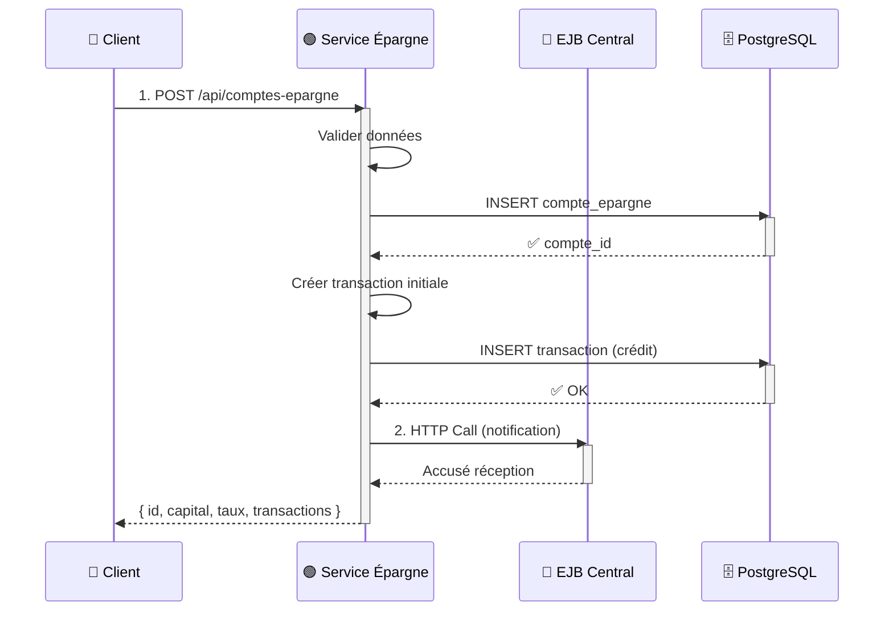

### Flux 3️⃣: Effectuer un Dépôt Épargne

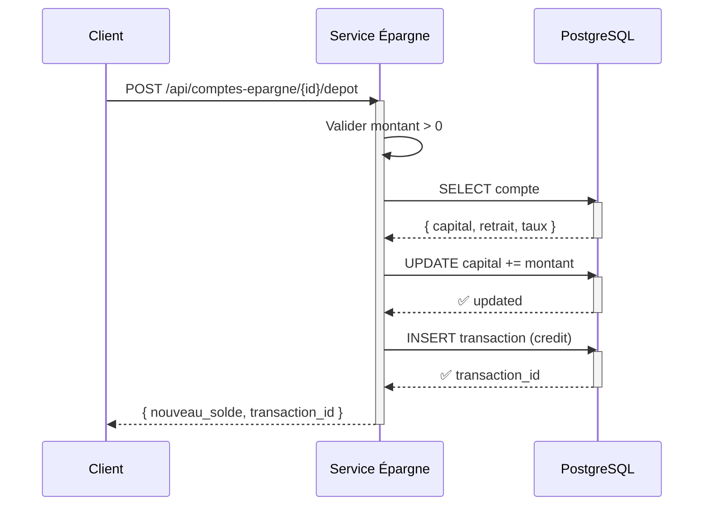

### Flux 4️⃣: Retrait Épargne avec Limite

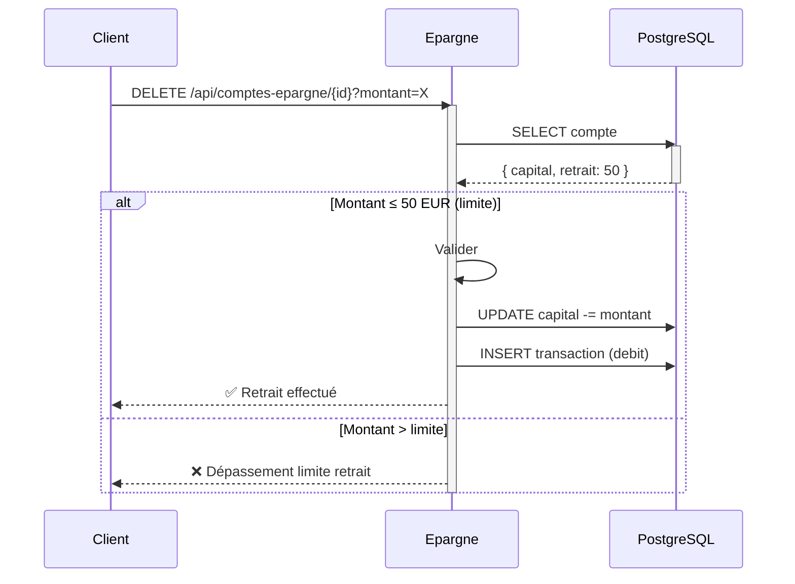

### Flux 5️⃣: Créer un Prêt avec Amortissement

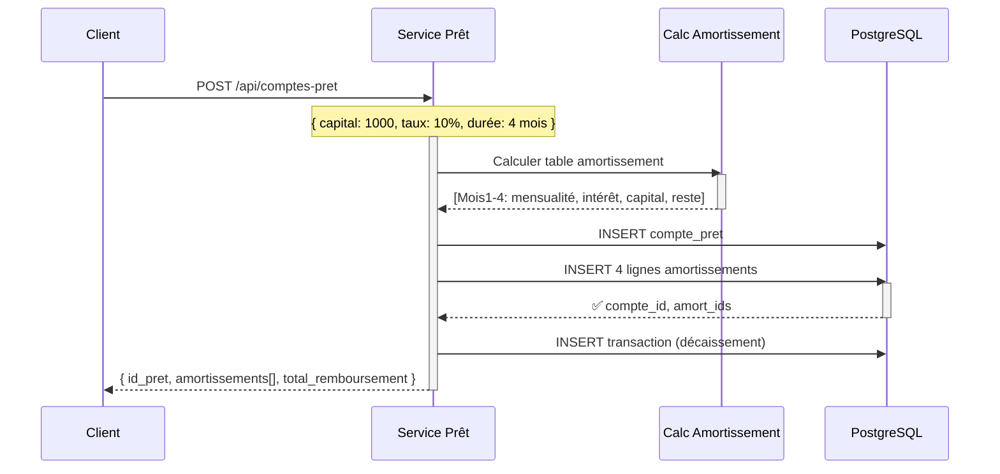

### Flux 6️⃣: Rembourser une Échéance de Prêt

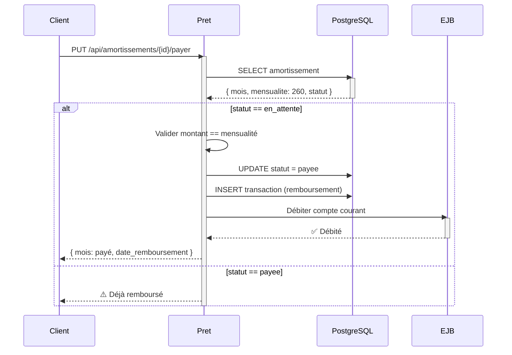

### Flux 7️⃣: Virement Inter-Comptes Courant

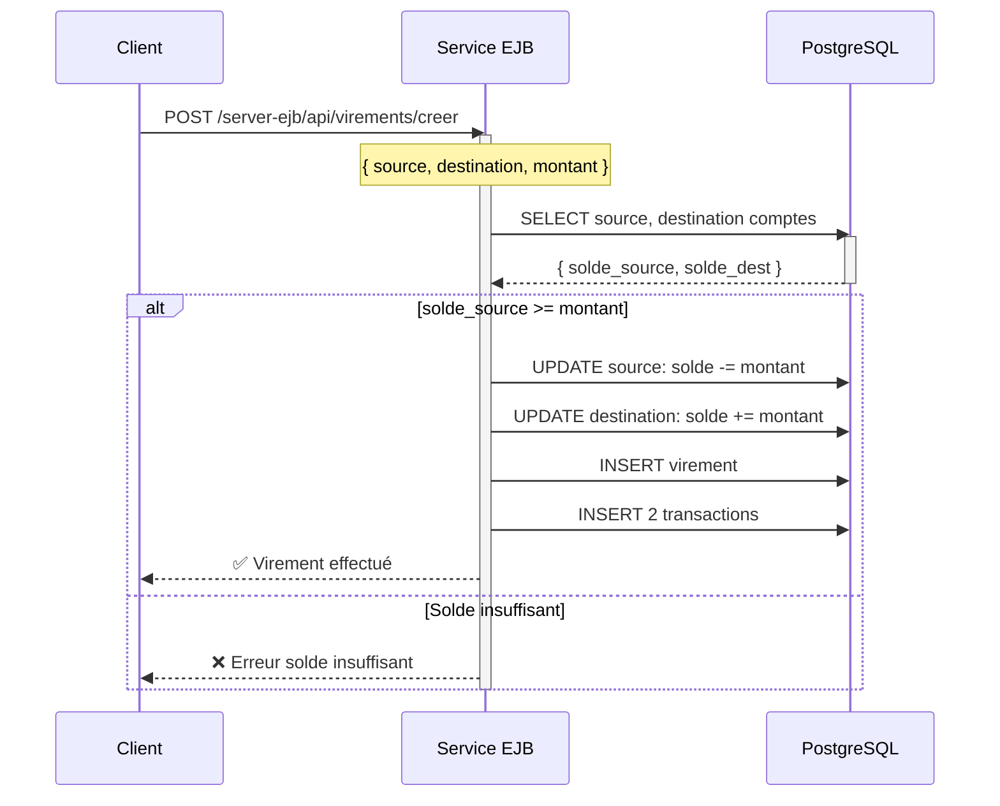

### Flux 8️⃣: Gestion des Devises (Change)

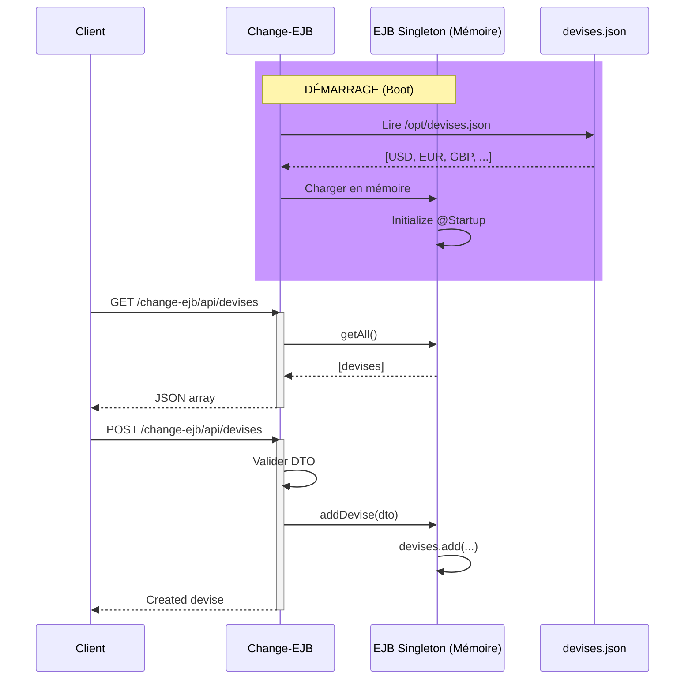

---

## �📊 Structure Technique

### 🗂️ Arborescence Complète

```
n-tiers_banque/
│
├── 📄 pom.xml                 (POM parent Maven)
├── 📄 n-tiers.sln             (Solution Visual Studio)
├── 🐳 docker-compose.yml      (Orchestration conteneurs)
│
├── 🔵 server-ejb/             (Compte courant - EJB)
│   ├── pom.xml
│   ├── Dockerfile
│   ├── module.xml
│   └── src/main/java/
│       └── com/example/
│           ├── models/        (45+ entités)
│           ├── repositories/  (18+ DAOs)
│           ├── service/       (15+ services)
│           └── mappers/       (17+ mappers)
│
├── 🟢 epargne/                (Service Épargne - .NET)
│   ├── epargne.csproj
│   ├── Dockerfile
│   ├── Program.cs             (Configuration)
│   ├── Controllers/           (3 contrôleurs)
│   ├── Services/              (Services métier)
│   ├── Models/                (Modèles BD)
│   ├── DTO/                   (DTOs API)
│   ├── ExternalApi/           (Clients HTTP)
│   ├── Mappers/               (Mappers)
│   └── Data/
│       └── AppDbContext.cs    (DbContext EF Core)
│
├── 🟡 pret/                   (Service Prêt - .NET)
│   ├── pret.csproj
│   ├── Dockerfile
│   ├── Program.cs             (Configuration)
│   ├── Controllers/           (3 contrôleurs)
│   ├── Services/              (Services métier)
│   ├── Models/                (Modèles BD)
│   ├── DTO/                   (DTOs API)
│   ├── ExternalApi/           (Clients HTTP)
│   ├── Mappers/               (Mappers)
│   └── Data/
│       └── AppDbContext.cs    (DbContext EF Core)
│
├── � change-api/             (Interfaces & DTOs - Change)
│   ├── pom.xml
│   └── src/main/java/com/example/
│       ├── remotes/
│       │   └── ChangeServiceRemote.java    (Interface EJB Remote)
│       ├── change_dtos/
│       │   └── DeviseDto.java              (DTO Devise)
│       └── utils/
│           └── DateUtils.java
│
├── 🟣 change-ejb/             (Implémentation Change - EJB)
│   ├── pom.xml
│   ├── Dockerfile
│   ├── devises.json           (Fichier données devises JSON)
│   └── src/main/java/com/example/
│       ├── services/
│       │   └── ChangeService.java          (EJB Singleton @Startup)
│       ├── controllers/
│       │   └── ChangeRestController.java   (REST endpoints @Path)
│       └── api/
│           └── RestApplication.java        (Config JAX-RS)
│
├── 🗄️ sql/                     (Schémas BD initiaux)
│   ├── courant/
│   │   └── compte_courant.sql (Tables + données test)
│   ├── epargne/
│   │   └── compte_epargne.sql (Tables + données test)
│   └── pret/
│       └── compte_pret.sql    (Tables + données test)
│
├── 📚 n-tiers api/            (Collections API)
│   ├── bruno.json
│   ├── collection.bru
│   ├── central/               (Endpoints EJB)
│   ├── compte_courant/
│   ├── epargne/
│   └── pret/                  (Endpoints prêt)
│
├── 🔨 Scripts de déploiement
│   ├── create.sh              (Créer images)
│   ├── deploy.sh              (Déployer)
│   ├── run.sh                 (Lancer conteneurs)
│   ├── restart.sh             (Redémarrer)
│   └── stop.sh                (Arrêter)
│
└── 📖 Documentation
    └── README.md / README_COMPLET.md
```

---

## 📈 Modèles de Données

### 1. Schéma Compte Courant (PostgreSQL - ejb_db)


**Données d'exemple**: 
- 1 client par direction
- 3-4 comptes par client
- 5+ transactions par compte

---

### 2. Schéma Épargne (PostgreSQL - epargne_db)


**Données d'exemple**:
- 4 comptes d'épargne (vacance, moto, rancard, ferrari)
- Capital initial: 200 à 20 000 EUR
- Taux intérêt: 2.75% à 4.00%
- 5 transactions test

---

### 3. Schéma Prêt (PostgreSQL - pret_db)


**Données d'exemple**:
- 1 prêt immobilier: 1000 EUR
- Taux: 10% annuel
- Durée: 4 mois
- Amortissements calculés pour 4 mois: 260 EUR/mois

---

---

## 📡 API Endpoints

### A. Service Compte Courant (EJB) - Port 9090

#### Gestion Clients
```http
GET    /server-ejb/api/clients                    → Liste tous clients
GET    /server-ejb/api/clients/{id}               → Client par ID
POST   /server-ejb/api/clients                    → Créer client
PUT    /server-ejb/api/clients/{id}               → Modifier client
DELETE /server-ejb/api/clients/{id}               → Supprimer client
```

#### Gestion Comptes Courant
```http
GET    /server-ejb/api/comptes-courants           → Tous comptes
GET    /server-ejb/api/comptes-courants/{id}      → Compte par ID
POST   /server-ejb/api/comptes-courants           → Créer compte
PUT    /server-ejb/api/comptes-courants/{id}      → Modifier compte
DELETE /server-ejb/api/comptes-courants/{id}      → Supprimer compte
```

#### Dépôts & Retraits
```http
POST   /server-ejb/api/depots                     → Effectuer dépôt
POST   /server-ejb/api/retraits                   → Effectuer retrait
GET    /server-ejb/api/historique-depots/{id}    → Historique dépôts
GET    /server-ejb/api/historique-retraits/{id}  → Historique retraits
```

#### Virements
```http
POST   /server-ejb/api/virements/creer            → Créer virement
GET    /server-ejb/api/virements/{id}             → Détails virement
GET    /server-ejb/api/historique-virements/{id} → Historique virements
```

---

### B. Service Change (Devises) - Port 9090

#### Gestion Devises
```http
GET    /change-ejb/api/devises                    → Toutes devises
GET    /change-ejb/api/devises/{id}               → Devise par ID
POST   /change-ejb/api/devises                    → Ajouter devise
PUT    /change-ejb/api/devises/{id}               → Modifier devise
DELETE /change-ejb/api/devises/{id}               → Supprimer devise
```

**Données**: Chargées depuis `/opt/devises.json` au démarrage du service
**Type**: EJB Singleton REST via JAX-RS

---

### C. Service Épargne (.NET) - Port 6000

#### Gestion Comptes Épargne
```http
GET    /api/comptes-epargne                       → Tous comptes épargne
GET    /api/comptes-epargne/{id}                  → Compte par ID
POST   /api/comptes-epargne                       → Créer compte
POST   /api/comptes-epargne/create                → Créer avec transaction
PUT    /api/comptes-epargne/{id}                  → Modifier compte
DELETE /api/comptes-epargne/{id}                  → Retrait/Suppression
```

#### Transactions Épargne
```http
GET    /api/transactions-epargne/{idCompte}      → Historique compte
POST   /api/transactions-epargne                  → Créer transaction
GET    /api/transactions-epargne/{id}             → Détails transaction
```

#### Gestion Clients
```http
GET    /api/persons                               → Liste clients
POST   /api/persons                               → Créer client
GET    /api/persons/{id}                          → Client par ID
```

---

### C. Service Prêt (.NET) - Port 5000

#### Gestion Prêts
```http
GET    /api/comptes-pret                          → Tous prêts
GET    /api/comptes-pret/{id}                     → Prêt par ID
POST   /api/comptes-pret                          → Créer prêt
PUT    /api/comptes-pret/{id}                     → Modifier
DELETE /api/comptes-pret/{id}                     → Supprimer
```

#### Amortissements
```http
GET    /api/amortissements/{idPret}               → Table amortissement
GET    /api/amortissements/{id}                   → Ligne amortissement
PUT    /api/amortissements/{id}/payer             → Payer échéance
GET    /api/amortissements/{id}/statut            → Statut remboursement
```

#### Transactions Prêt
```http
GET    /api/transactions-pret/{idPret}            → Historique
POST   /api/transactions-pret                     → Enregistrer transaction
```

---

## 🚀 Installation et Déploiement

### Prérequis

| Outil | Version | Utilisé pour |
|-------|---------|-------------|
| **Docker** | 20.10+ | Conteneurisation et orchestration |
| **Docker Compose** | 2.0+ | Orchestration multi-conteneurs |
| **Git** | 2.30+ | Cloner le projet |

**Note**: Les autres outils (Java, .NET, Maven, PostgreSQL) sont inclus dans les conteneurs Docker.

> **Si tu n'as pas WildFly installé localement**: Le serveur WildFly Core 19.0.1.Final est automatiquement inclus dans le conteneur `change-server`. Pas besoin de l'installer si tu utilises Docker!
> 
> Si tu as besoin de WildFly en standalone: [Télécharger WildFly Core 19.0.1.Final](https://www.wildfly.org/downloads/)

---

### Déploiement Rapide avec Docker (Seule option recommandée)

#### Étape 1: Cloner le projet
```bash
git clone <repository-url>
cd n-tiers_banque
```

#### Étape 2: Lancer le déploiement
```bash
# Option A: Exécuter le script de déploiement
./deploy.sh

# Option B: Lancer directement avec Docker Compose
docker-compose up -d
```

**Services démarrés automatiquement**:
- ✅ WildFly (EJB) - Change + Server - Port 9090
- ✅ Service Épargne (.NET) - Port 6000
- ✅ Service Prêt (.NET) - Port 5000
- ✅ PostgreSQL (Compte Courant) - Port 5434
- ✅ PostgreSQL (Épargne) - Port 5432
- ✅ PostgreSQL (Prêt) - Port 5433

#### Étape 3: Vérifier le déploiement
```bash
# Voir les conteneurs actifs
docker ps

# Voir les logs d'un service
docker logs change-server    # WildFly + Change + Server
docker logs epargne          # Service Épargne
docker logs pret             # Service Prêt
docker logs postgres-ejb     # BD Courant

# Voir les logs en temps réel
docker-compose logs -f
docker-compose logs -f epargne
docker-compose logs -f pret
```


## 💻 Utilisation

### 1️⃣ Collection Postman/Bruno

Des collections API sont disponibles dans `n-tiers api/`:

```bash
# Ouvrir dans Bruno (alternative Postman)
bruno collection.bru

# Ou importer dans Postman
# Fichier: n-tiers api/collection.bru
```

**Collections disponibles**:
- `epargne/` → Endpoints Épargne
- `pret/` → Endpoints Prêt

---

### 2️⃣ Scénarios de Test Complet sur Interface Web (client-ejb)

**URL Base**: `http://localhost:9090/client-ejb/`

#### 🔐 Scénario 0: Se Connecter (Login)

1. Accéder à: `http://localhost:9090/client-ejb/login`
2. **Email**: `@gmail` (pré-rempli)
3. **Mot de passe**: `1234` (pré-rempli)
4. Cliquer sur **"Se connecter"**
5. Redirection vers la page d'accueil

**Screenshot 1 - Page de Login**:


**Screenshot 2 - Page d'Accueil (Après Login)**:


---

#### 💰 Scénario 1: Effectuer un Dépôt sur Compte Courant

**Étapes**:

1. Se connecter (voir Scénario 0)
2. Accéder à: `/courants/depot_liste.jsp`
3. Voir la liste des dépôts existants
4. Cliquer sur **"Nouveau Dépôt"** ou accéder `/courants/depot_form.jsp`
5. Remplir le formulaire:
   - **Compte**: Sélectionner un compte dans la liste
   - **Montant**: Entrer montant (ex: 500.00)
   - **Description**: Entrer description (ex: "Salaire mois de Janvier")
6. Cliquer **"Valider"**
7. Confirmation du dépôt avec numéro de transaction

**Screenshots à capturer**:

**Screenshot 3 - Liste des Dépôts**:


**Screenshot 4 - Formulaire Dépôt**:


**Screenshot 5 - Confirmation Dépôt**:


---

#### 🏧 Scénario 2: Effectuer un Retrait

**Étapes**:

1. Depuis la page d'accueil, accéder à: `/courants/retrait_liste.jsp`
2. Voir la liste des retraits existants
3. Cliquer sur **"Nouveau Retrait"** ou accéder `/courants/retrait_form.jsp`
4. Remplir le formulaire:
   - **Compte**: Sélectionner un compte courant
   - **Montant**: Entrer le montant (ex: 200.00)
   - **Description**: Raison du retrait
5. Cliquer **"Valider"**
6. Le système valide le solde suffisant
7. Confirmation avec mise à jour du solde

**Screenshots à capturer**:

**Screenshot 6 - Liste Retraits**:


**Screenshot 7 - Formulaire Retrait**:


**Screenshot 8 - Confirmation Retrait**:


---

#### 💸 Scénario 3: Effectuer un Virement Inter-Comptes

**Étapes**:

1. Accéder à: `/courants/virement_liste.jsp`
2. Voir l'historique des virements
3. Cliquer **"Nouveau Virement"** ou accéder `/courants/virement_courant_form.jsp`
4. Remplir le formulaire:
   - **Compte Source**: Sélectionner compte à débiter
   - **Compte Destination**: Sélectionner compte à créditer
   - **Montant**: Montant à virer (ex: 150.00)
   - **Description**: Motif du virement
5. Cliquer **"Valider"**
6. Confirmation avec mise à jour des deux comptes

**Screenshots à capturer**:

**Screenshot 9 - Liste Virements**:


**Screenshot 10 - Formulaire Virement**:


**Screenshot 11 - Confirmation Virement**:


---

#### 📊 Scénario 4: Consulter Transactions d'un Compte

**Étapes**:

1. Accéder à: `/courants/transaction_courant_liste.jsp`
2. Optionnel: Filtrer par compte (dropdown)
3. Voir le tableau complet avec toutes les transactions:
   - Dépôts (sens: Crédit)
   - Retraits (sens: Débit)
   - Virements (Sortie/Entrée)
4. Consulter détails: Date, Montant, Type, Description, Ancien/Nouveau Solde

**Screenshots à capturer**:

**Screenshot 12 - Liste Transactions**:


---

#### 💱 Scénario 5: Gérer les Devises

**Étapes**:

1. Accéder à: `/devises/devise_liste.jsp`
2. Voir la liste des devises disponibles:
   - USD, EUR, GBP, JPY, etc.
   - Colonnes: Code, Nom, Taux de Change, Date de Validation
3. Cliquer **"Ajouter Devise"** ou accéder `/devises/devise_form.jsp`
4. Remplir le formulaire:
   - **Code**: Code devise (ex: CHF)
   - **Nom**: Nom complet (ex: Franc Suisse)
   - **Taux**: Valeur en Ariary (ex: 4200.50)
   - **Date Début**: Date à partir de laquelle valide
5. Cliquer **"Enregistrer"**
6. Confirmation d'ajout avec apparition dans la liste

**Screenshots à capturer**:

**Screenshot 14 - Liste Devises**:

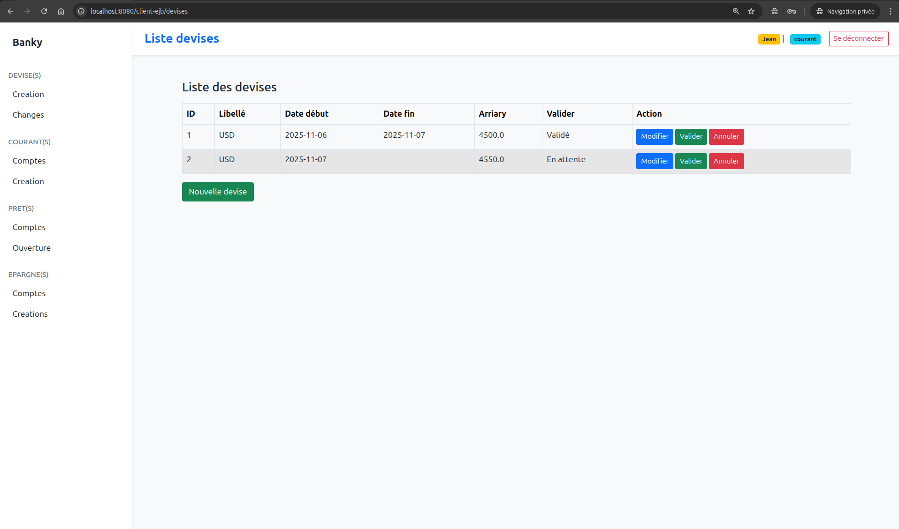

**Screenshot 15 - Formulaire Ajout Devise**:

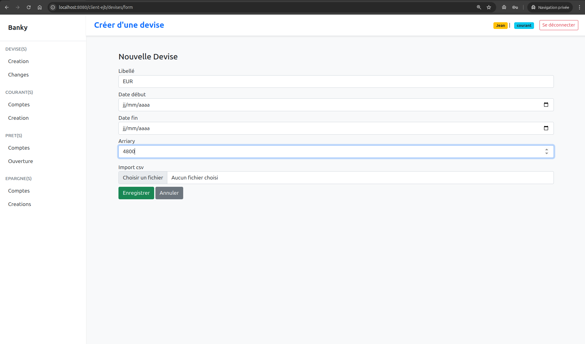

**Screenshot 16 - Confirmation Devise Ajoutée**:

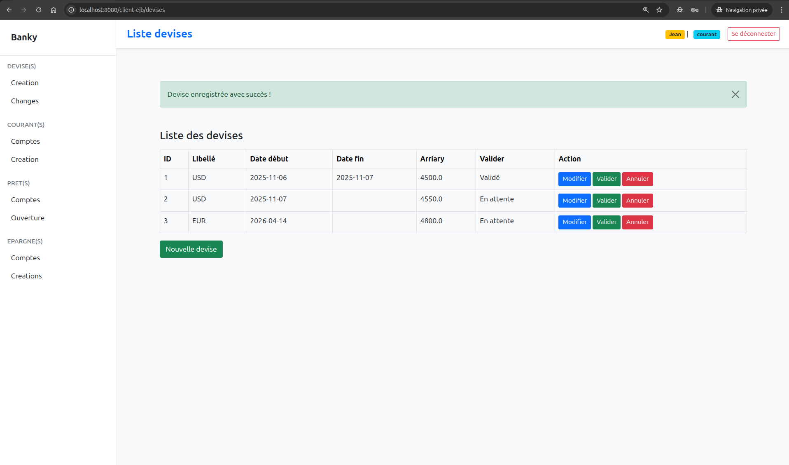

---

#### 🏦 Scénario 5 BIS: Gérer les Comptes Épargne

**Étapes**:

1. Accéder à: `http://localhost:6000/api/comptes-epargne` (API .NET) ou via interface web
2. Voir la liste des comptes épargne
3. Cliquer **"Créer Nouveau Compte"**
4. Remplir le formulaire:
   - **Client ID**: ID du client (ex: 1)
   - **Capital Épargne**: Montant initial (ex: 1000.00)
   - **Libellé**: Nom du compte (ex: "Vacances 2026")
   - **Taux Intérêt**: Taux annuel (ex: 3.50%)
5. Cliquer **"Créer"**
6. Confirmation avec ID compte créé

**Screenshots à capturer**:

**Liste Comptes Épargne**:

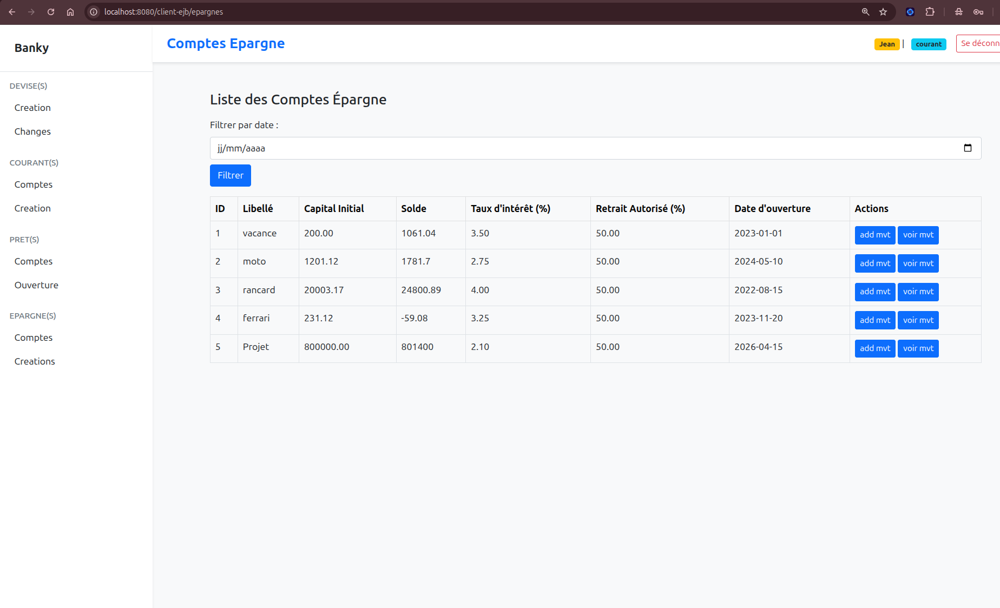

**Formulaire Création Compte Épargne**:

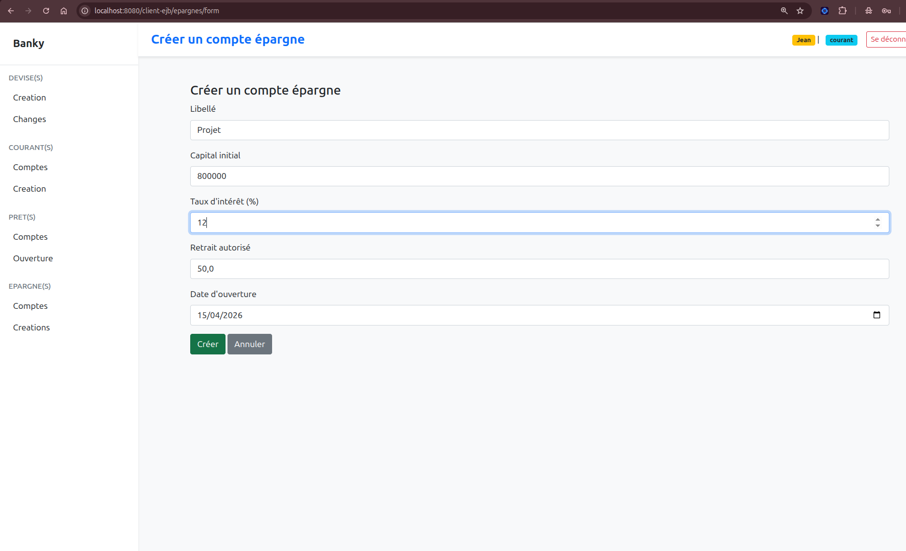

##### 💰 Effectuer Dépôt Épargne

**Étapes**:

1. Depuis la liste, sélectionner un compte épargne
2. Cliquer **"Effectuer Dépôt"**
3. Entrer montant (ex: 500.00)
4. Cliquer **"Confirmer"**

**Screenshots à capturer**:

**Dépôt Épargne**:

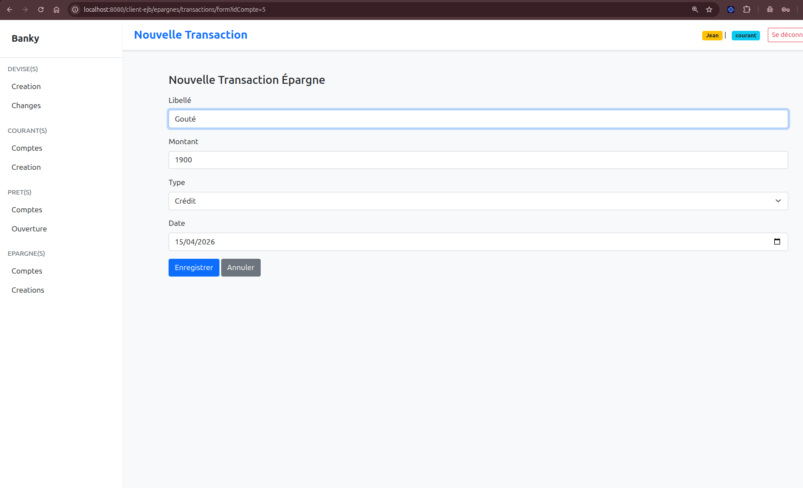

##### 🏧 Effectuer Retrait Épargne (avec limite)

**Étapes**:

1. Depuis la liste, sélectionner un compte épargne
2. Cliquer **"Effectuer Retrait"**
3. Entrer montant (ex: 50.00 - respecte limite)
4. Cliquer **"Confirmer"**
5. Système vérifie:
   - Montant ≤ limite de retrait (50 EUR par défaut)
   - Solde devient positif après retrait

**Screenshots à capturer**:

**Retrait Épargne**:


##### 📋 Historique Transactions Épargne

**Étapes**:

1. Sélectionner compte épargne
2. Cliquer **"Voir Transactions"**
3. Tableau avec:
   - Date, Libellé, Montant, Sens (débit/crédit)
   - Historique de tous les mouvements

**Screenshots à capturer**:

**Historique Épargne**:


---

#### 📋 Scénario 6: Créer un Nouveau Prêt

**Étapes**:

1. Accéder à: `/create/form_pret.jsp`
2. Remplir le formulaire de création de prêt:
   - **Client**: Sélectionner client
   - **Montant Emprunté**: Capital (ex: 5000.00)
   - **Taux d'Intérêt Annuel**: % (ex: 8.5)
   - **Durée en Mois**: Durée remboursement (ex: 24)
   - **Description**: Motif du prêt (ex: "Immobilier")
3. Cliquer **"Calculer Amortissements"**
4. Voir le tableau d'amortissement avec:
   - Mois 1 à N (mensualités, intérêts, capital, reste dû)
5. Cliquer **"Créer Prêt"**
6. Confirmation avec numéro de contrat

**Screenshots à capturer**:

**Formulaire Création Prêt**:

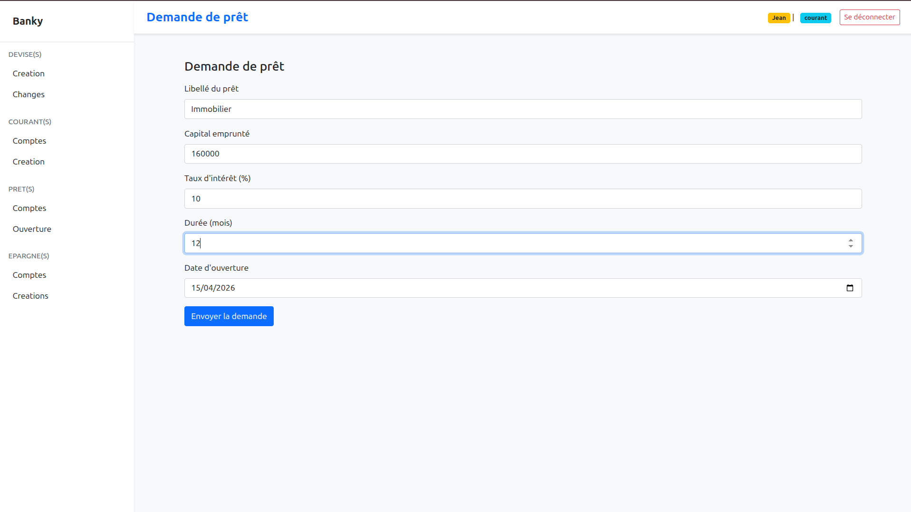

**Table Amortissement Calculée**:


**Table Amortissement Calculée**:

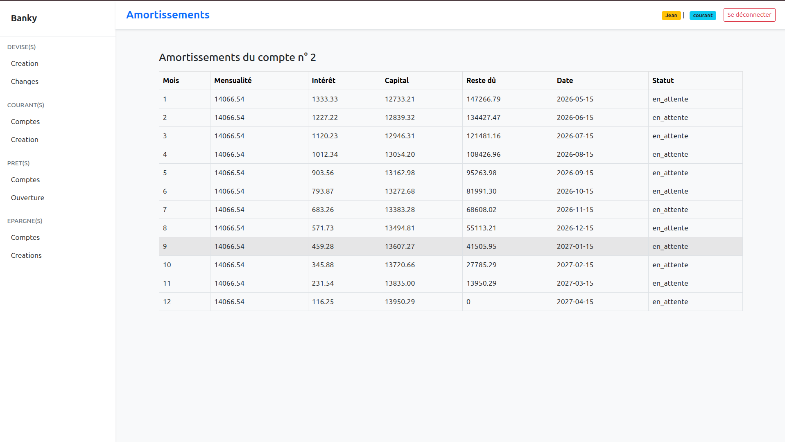

**Rembourssement flexible par mois**:

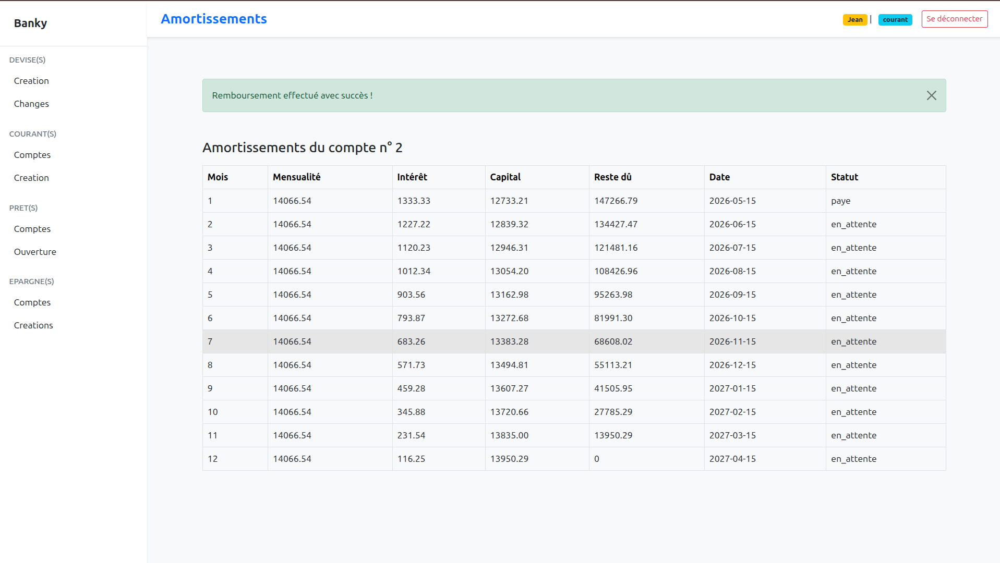

## 🛠️ Technologies et Stack

### Backend

| Couche | Technologie | Version | Rôle |
|--------|-------------|---------|------|
| **EJB** | Jakarta EE | 9.1 | Compte courant, devises |
| **.NET** | ASP.NET Core | 8.0 | Épargne, prêts |
| **ORM Java** | Jakarta Persistence | 3.1 | Mapping ORM EJB |
| **ORM .NET** | Entity Framework Core | 8.0 | Mapping ORM .NET |
| **Serveur App** | WildFly | 19.0.1 | Conteneur EJB |

### Données

| Base | Technologie | Port | Utilité |
|------|-------------|------|---------|
| **PostgreSQL** | 16 | 5434 | Compte courant (ejb_db) |
| **PostgreSQL** | 16 | 5432 | Épargne (epargne_db) |
| **PostgreSQL** | 16 | 5433 | Prêt (pret_db) |

### API

| Aspect | Technologie |
|--------|-------------|
| **Style** | REST / OpenAPI |
| **Sérialisation** | JSON |

### Infrastructure

| Outil | Version | Usage |
|------|---------|-------|
| **Docker** | 20.10+ | Conteneurs |
| **Docker Compose** | 2.0+ | Orchestration |
| **Maven** | 3.8+ | Build Java |
| **.NET SDK** | 8.0+ | Build C# |
| **Git** | 2.30+ | VCS |

---

---
## ⚙️ Configuration et Variables d'Environnement

### Variables Docker (docker-compose.yml)

```yaml
# PostgreSQL Épargne
POSTGRES_DB: epargne_db
POSTGRES_USER: postgres
POSTGRES_PASSWORD: postgres

# PostgreSQL Prêt
POSTGRES_DB: pret_db
POSTGRES_USER: postgres
POSTGRES_PASSWORD: postgres

# PostgreSQL EJB
POSTGRES_DB: ejb_db
POSTGRES_USER: postgres
POSTGRES_PASSWORD: postgres

# Services .NET
ASPNETCORE_ENVIRONMENT: Development
ConnectionStrings__DefaultConnection: Host=postgres-epargne;Database=epargne_db;Username=postgres;Password=postgres
```
psql -h localhost -p 5432 -U postgres -d epargne_db
psql -h localhost -p 5433 -U postgres -d pret_db
psql -h localhost -p 5434 -U postgres -d ejb_db


## 📝 Notes Importantes

### ⚠️ Limitations Connues

1. **Pas d'authentification JWT**: À implémenter pour la production
2. **Transaction distribuée limitée**: Pas de saga distribuée complète
3. **Pas de cache Redis**: Performance non optimisée
4. **Données test limitées**: À étendre avec davantage de scénarios
5. **Pas de logging centralisé**: Chaque service a ses propres logs

### ✅ Bonnes Pratiques Implantées

- ✓ Séparation des responsabilités (3-tiers)
- ✓ Mappers DTO pour API
- ✓ Services métier
- ✓ Repositories pour accès données
- ✓ Validation des données
- ✓ Gestion des erreurs
- ✓ Modèles JPA/EF Core
- ✓ Historiques des transactions

---

## 🤝 Contribution

Pour ajouter des fonctionnalités:

1. Créer une branche: `git checkout -b feature/nom-feature`
2. Implémenter la fonctionnalité
3. Tester localement
4. Committer: `git commit -m "Ajout fonctionnalité X"`
5. Pusher: `git push origin feature/nom-feature`
6. Créer une Pull Request

---

## 📄 Licence

Projet académique - 2025 - Opensource
